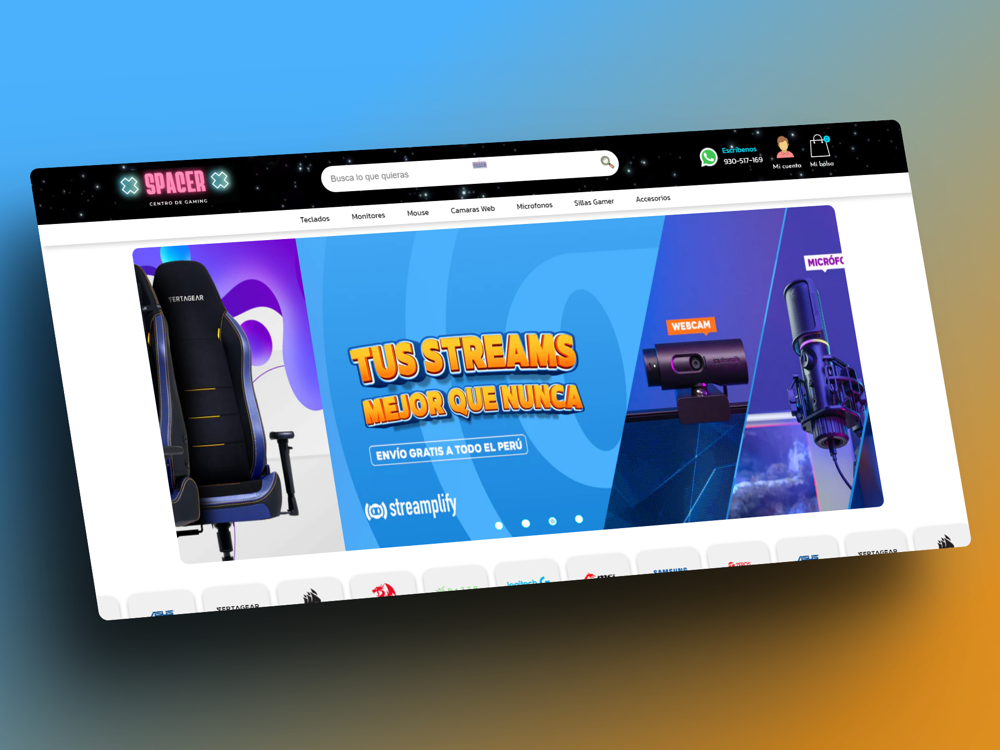
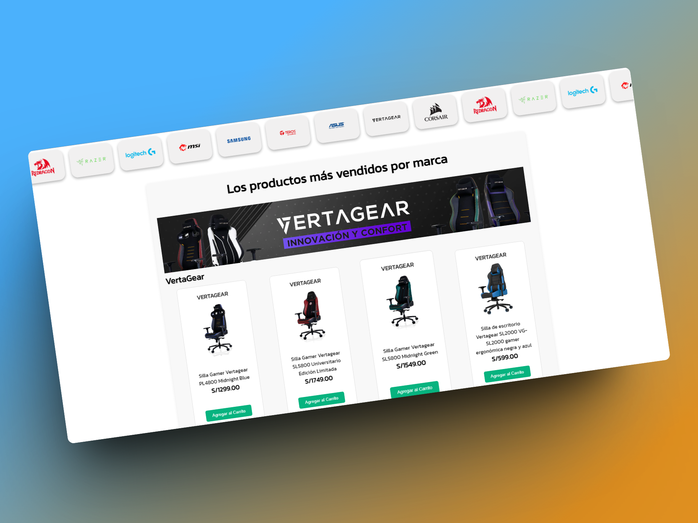
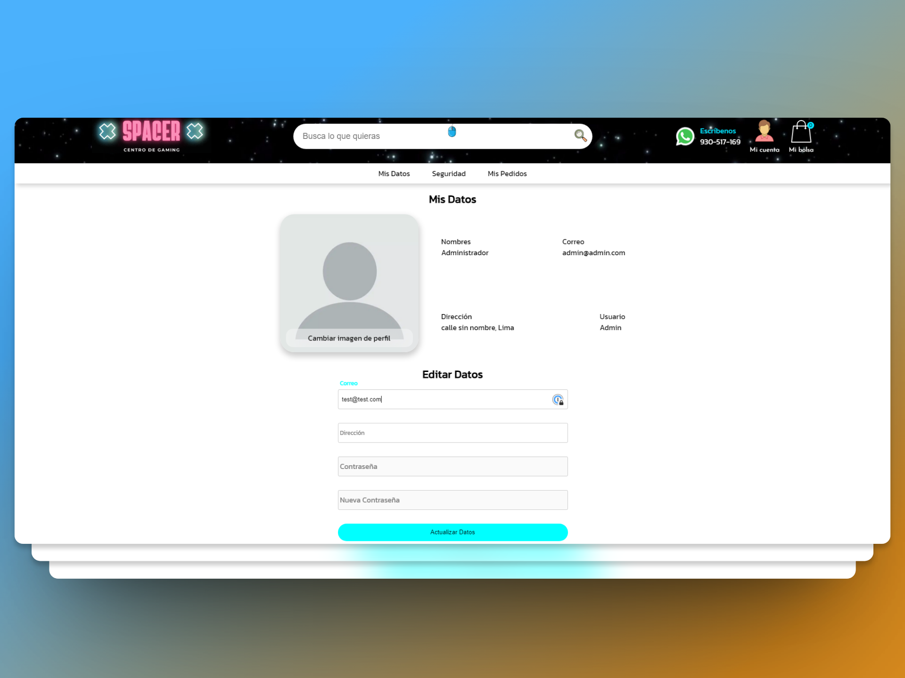

# Proyecto Spacer: Tu Tienda Gamer Favorita 🎮

¡Bienvenido a Spacer, la tienda gamer donde encontrarás todo lo que necesitas para potenciar tu PC gamer al máximo! Este proyecto es parte del curso de Desarrollo Web Integrado de la Universidad Tecnológica del Perú (UTP).

## Equipo de Desarrollo 🧑‍💻

- Jorge Luis Moreno Moller (Backend y Frontend)
- Javier Enrique Quispe Mamani (Frontend)
- Daniel Enrique Cano Urpeque (Base de Datos)
- Jesus Andres Ccerhhuayo Ccerhuayo (Frontend)

Profesor: Carlos Fernando Zamora Guanilo

## Descripción del Proyecto 🖋️

El objetivo de este proyecto llamado Spacer es crear una tienda en línea especializada en componentes y accesorios para los PC gamers. El eCommerce ofrece una amplia gama de productos de alta calidad para mejorar la experiencia de juego del cliente.

### Funcionalidades Destacadas 🌟

- Autenticación de Usuarios (Login y Registro)
- Exploración de Productos
- Carrito de Compras
- Administración de Usuario (Cliente)
- Panel de Administrador (Administradores)
- Emulación SPA en página de productos
- Encriptación de contraseñas

## Tecnologías Utilizadas⚡

### Frontend

- HTML
- CSS (con animaciones personalizadas)
- JavaScript (sin frameworks)

### Backend

- Java
- Spring Boot
- MySQL (gestionado con phpMyAdmin)
- Spring Security
- JWT para autenticación
- Redis (manejador de caché)
- BCrypt

## Despliegue 🚀

- Frontend: Desplegado en [Vercel](https://spacer-ecommerce.vercel.app)
- Backend: Originalmente desplegado en [Railway](https://spacer-api.up.railway.app), posiblemente se migre a otro host.

## Cómo Iniciar ⚙️

1. Clona el repositorio.
2. Configura la base de datos en tu servidor local o remoto.
3. Inicia el servidor backend.
4. Abre el cliente en tu navegador.

## Capturas de Pantalla 📷

## Contribuciones

El proyecto fue desarrollado por Jorge Luis Moreno Moller, Javier Enrique Quispe Mamani, Daniel Enrique Cano Urpeque y Jesus Andres Ccerhhuayo Ccerhuayo.

---

¡Gracias por visitar Spacer! Esperamos que disfrutes tu experiencia de compra con este proyecto.
